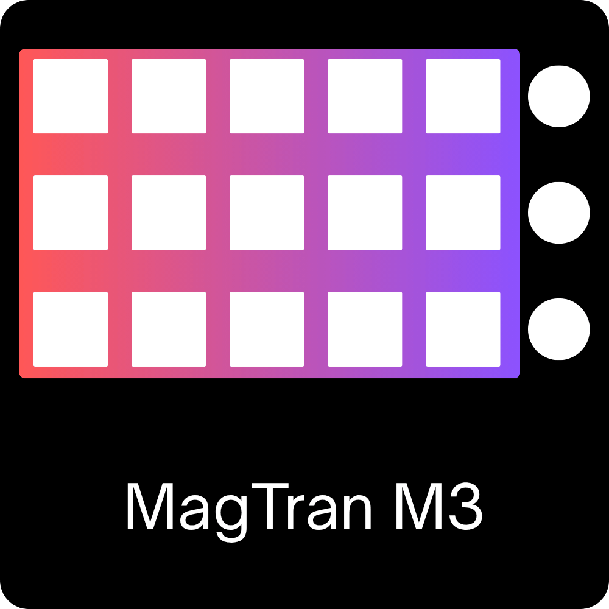

# OpenDeck MagTran M3 Plugin

An unofficial plugin for MagTran M3 family devices.

Requires OpenDeck 2.5.0 or newer

## Supported devices
- Confirmed Working:
  - ActionRing MagTran M3 (5548:1038)
- Untested:
  - VSD Inside M3 [5548:1020] (Theoretically the same device with a different product ID)

> [!IMPORTANT]
> Static background images are supported. Animated backgrounds are not yet supported.

## Platform support

- Linux: Supported
- Mac: Probably works?
- Windows: Not Supported (Settings IPC uses Unix sockets, so would need to use something like named pipes on Windows)

## Installation

1. Download [The latest release](https://github.com/CoreParadox/opendeck-m3/releases)
2. In OpenDeck: Plugins -> Install from file
3. Linux: install the [udev rules](./60-opendeck-magtran-m3.rules)
    - (Copy into `/etc/udev/rules.d/` and run `sudo udevadm control --reload-rules`)
4. Reconnect the device and restart OpenDeck

## Acknowledgments

This plugin was developed using several existing device plugins as reference:
- [opendeck-akp153](https://github.com/4ndv/opendeck-akp153) by 4ndv
- [opendeck-m3](https://github.com/sakloui/opendeck-m3) by sakloui
- [tacto-connect](https://github.com/RivulusLive/tacto-connect-source) by nekename
- [rust-elgato-streamdeck](https://github.com/OpenActionAPI/rust-elgato-streamdeck) by nekename

## License

GPL-3.0